# Catálogo de casos de prueba E2E — LTI

Catálogo de los casos E2E implementados con Cypress para LTI. Cada caso está vinculado al flujo E2E de [`docs/README.md`](../../docs/README.md) del que proviene.

- **MND**: escenarios obligatorios de la interfaz *Position* (carga del tablero y cambio de fase de un candidato).
- **EXT**: resto de flujos del sistema, incluida funcionalidad aún no desarrollada.
- **MND + EXT = total de casos.**

La estrategia (datos de prueba, simulación del arrastre, tests pendientes) y el detalle de los defectos están en [`docs/README.md` §11](../../docs/README.md#11-pruebas-e2e-con-cypress).

---

## 1. Resumen

| Tipo | Casos | Pasan | Fallan | Pendientes |
|:---|:---:|:---:|:---:|:---:|
| **MND** | 6 | 6 | 0 | 0 |
| **EXT** | 38 | 31 | 1 | 6 |
| **Total** | **44** | **37** | **1** | **6** |

| Flujo E2E | MND | EXT | Total | Spec |
|:---|:---:|:---:|:---:|:---|
| F1. Dashboard y disponibilidad | – | 4 | 4 | [`EXT/dashboard.cy.js`](../e2e/EXT/dashboard.cy.js) |
| F2. Alta de candidato | – | 8 | 8 | [`EXT/candidates.cy.js`](../e2e/EXT/candidates.cy.js) |
| F3. Subida de CV | – | 4 | 4 | [`EXT/candidates.cy.js`](../e2e/EXT/candidates.cy.js) |
| F4. Consulta de candidato | – | 1 | 1 | [`EXT/candidates.cy.js`](../e2e/EXT/candidates.cy.js) |
| F5. Listado de posiciones | – | 9 | 9 | [`EXT/positions_list.cy.js`](../e2e/EXT/positions_list.cy.js) |
| F6. Tablero Position: carga y navegación | 3 | 4 | 7 | [`integration/position.spec.js`](../integration/position.spec.js) |
| F7. Tablero Position: cambio de fase | 3 | 5 | 8 | [`integration/position.spec.js`](../integration/position.spec.js) |
| F8. Detalle del candidato y entrevistas | – | 3 | 3 | [`integration/position.spec.js`](../integration/position.spec.js) |
| **Total** | **6** | **38** | **44** | |

**Leyenda de estados**

| Estado | Significado |
|:---|:---|
| **PASA** | El caso se ejecuta y cumple todas sus aserciones. |
| **FALLA** | El caso se ejecuta y falla por un defecto conocido del sistema (ver columna *Defecto*). |
| **PENDIENTE** | Funcionalidad aún no desarrollada: el test está escrito completo con `it.skip`. |

---

## 2. Mapa visual de flujos

Recorrido del usuario por el sistema con los casos que cubren cada paso. Colores: azul = MND, verde = EXT que pasa, rojo = EXT que falla, gris punteado = EXT pendiente.

```mermaid
flowchart LR
    subgraph F1["F1. Dashboard y disponibilidad"]
        direction TB
        EXT01["EXT-01 Contenido del dashboard"]
        EXT02["EXT-02 Ir a alta de candidato"]
        EXT03["EXT-03 Ir a posiciones"]
        EXT04["EXT-04 Health check API"]
    end

    subgraph F2["F2. Alta de candidato"]
        direction TB
        EXT05["EXT-05 Alta con datos personales"]
        EXT06["EXT-06 Alta con educación y experiencia"]
        EXT07["EXT-07 Añadir / eliminar secciones"]
        EXT08["EXT-08 Campos obligatorios vacíos"]
        EXT09["EXT-09 Email mal formado"]
        EXT10["EXT-10 Nombre inválido"]
        EXT11["EXT-11 Teléfono inválido"]
        EXT12["EXT-12 Email duplicado"]
    end

    subgraph F3["F3. Subida de CV"]
        direction TB
        EXT13["EXT-13 CV PDF asociado al candidato"]
        EXT14["EXT-14 CV DOCX"]
        EXT15["EXT-15 Tipo no permitido"]
        EXT16["EXT-16 Archivo mayor de 10MB"]
    end

    subgraph F4["F4. Consulta de candidato"]
        direction TB
        EXT17["EXT-17 GET /candidates/:id 404 y 400"]
    end

    subgraph F5["F5. Listado de posiciones"]
        direction TB
        EXT18["EXT-18 Solo posiciones visibles"]
        EXT19["EXT-19 Datos de la tarjeta"]
        EXT20["EXT-20 Ver proceso"]
        EXT21["EXT-21 Volver al dashboard"]
        EXT22["EXT-22 Filtro por título"]
        EXT23["EXT-23 Filtro por fecha"]
        EXT24["EXT-24 Filtro por estado"]
        EXT25["EXT-25 Filtro por manager"]
        EXT26["EXT-26 Editar posición"]
    end

    subgraph F6["F6. Tablero Position: carga y navegación"]
        direction TB
        MND01["MND-01 Título de la posición"]
        MND02["MND-02 Columnas por fase"]
        MND03["MND-03 Tarjetas en su fase"]
        EXT29["EXT-29 Puntuación media en tarjeta"]
        EXT34["EXT-34 Volver a posiciones"]
        EXT35["EXT-35 Posición sin fases"]
        EXT36["EXT-36 Posición inexistente"]
    end

    subgraph F7["F7. Tablero Position: cambio de fase"]
        direction TB
        MND04["MND-04 Arrastre mueve la tarjeta"]
        MND05["MND-05 PUT /candidates/:id"]
        MND06["MND-06 Fase persistida"]
        EXT27["EXT-27 Cambio de fase con teclado"]
        EXT28["EXT-28 Soltar fuera de columna"]
        EXT33["EXT-33 Error del backend en PUT"]
        EXT37["EXT-37 PUT aplicación inexistente"]
        EXT38["EXT-38 PUT datos no numéricos"]
    end

    subgraph F8["F8. Detalle del candidato y entrevistas"]
        direction TB
        EXT30["EXT-30 Abrir panel de detalle"]
        EXT31["EXT-31 Cerrar panel"]
        EXT32["EXT-32 Registrar entrevista"]
    end

    F1 --> F2
    F2 --> F3
    F2 -.-> F4
    F1 --> F5
    F5 --> F6
    F6 --> F7
    F6 --> F8

    classDef mnd fill:#dbeafe,stroke:#1d4ed8,stroke-width:2px,color:#0f172a
    classDef pass fill:#dcfce7,stroke:#15803d,color:#0f172a
    classDef fail fill:#fee2e2,stroke:#b91c1c,stroke-width:2px,color:#0f172a
    classDef pending fill:#f1f5f9,stroke:#64748b,stroke-dasharray:4 3,color:#334155

    class MND01,MND02,MND03,MND04,MND05,MND06 mnd
    class EXT01,EXT02,EXT03,EXT04,EXT05,EXT07,EXT08,EXT09,EXT10,EXT11,EXT12,EXT13,EXT14,EXT15,EXT16,EXT17,EXT18,EXT19,EXT20,EXT21,EXT27,EXT28,EXT29,EXT30,EXT31,EXT33,EXT34,EXT35,EXT36,EXT37,EXT38 pass
    class EXT06 fail
    class EXT22,EXT23,EXT24,EXT25,EXT26,EXT32 pending
```



---

## 3. Tabla maestra de casos

Datos de partida: la BD se resetea y se carga con `backend/prisma/seed.ts`. La posición 1, "Senior Full-Stack Engineer", tiene tres fases:

| Fase | Candidatos |
|:---|:---|
| Initial Screening | Carlos García |
| Technical Interview | John Doe, Jane Smith |
| Manager Interview | (vacía) |

### F1. Dashboard y disponibilidad

| ID | Tipo | Caso de prueba | Given / When / Then | Ref. docs | Estado | Defecto |
|:---|:---:|:---|:---|:---:|:---:|:---:|
| EXT-01 | EXT | Contenido del dashboard | **Given** el reclutador abre `/`<br>**When** carga la página<br>**Then** se ven el logo, el título "Dashboard del Reclutador" y los botones "Añadir Nuevo Candidato" e "Ir a Posiciones" | §7.2 | **PASA** | – |
| EXT-02 | EXT | Ir a alta de candidato | **Given** el reclutador está en el dashboard<br>**When** pulsa "Añadir Nuevo Candidato"<br>**Then** navega a `/add-candidate` con el título "Agregar Candidato" | §7.2 | **PASA** | – |
| EXT-03 | EXT | Ir a posiciones | **Given** el reclutador está en el dashboard<br>**When** pulsa "Ir a Posiciones"<br>**Then** navega a `/positions` con el título "Posiciones" | §3.4 | **PASA** | – |
| EXT-04 | EXT | Health check de la API | **Given** el backend está levantado<br>**When** se invoca `GET /`<br>**Then** responde 200 con "Hola LTI!" | §9.1 | **PASA** | – |

### F2. Alta de candidato

| ID | Tipo | Caso de prueba | Given / When / Then | Ref. docs | Estado | Defecto |
|:---|:---:|:---|:---|:---:|:---:|:---:|
| EXT-05 | EXT | Alta con datos personales válidos | **Given** el formulario de alta está abierto<br>**When** introduce nombre, apellido, email único, teléfono y dirección válidos y pulsa "Enviar"<br>**Then** `POST /candidates` responde 201, el candidato se recupera con `GET /candidates/:id` y se muestra "Candidato añadido con éxito" | §3.2, §4.1 | **PASA** | – |
| EXT-06 | EXT | Alta con educación y experiencia laboral | **Given** el formulario de alta está abierto<br>**When** añade una educación y una experiencia con fechas y envía<br>**Then** el payload lleva las fechas en `YYYY-MM-DD`, responde 201 y ambas quedan persistidas | §3.2, §4.1 | **FALLA** | D-01 |
| EXT-07 | EXT | Añadir y eliminar secciones | **Given** el formulario de alta está abierto<br>**When** añade dos educaciones y elimina una, y añade una experiencia y la elimina<br>**Then** queda 1 educación y 0 experiencias | §3.2 | **PASA** | – |
| EXT-08 | EXT | Campos obligatorios vacíos | **Given** el formulario está vacío<br>**When** pulsa "Enviar"<br>**Then** el navegador marca el campo "Nombre" como requerido, no hay alertas y no se envía `POST /candidates` | §4.2 | **PASA** | – |
| EXT-09 | EXT | Email mal formado | **Given** nombre y apellido válidos<br>**When** introduce el email "correo-invalido" y envía<br>**Then** el navegador marca el email como inválido y no se envía `POST /candidates` | §4.2 | **PASA** | – |
| EXT-10 | EXT | Nombre con caracteres inválidos | **Given** el formulario de alta está abierto<br>**When** introduce el nombre "Ana123" y envía<br>**Then** responde 400 y se muestra una alerta con "Invalid name" | §4.2 | **PASA** | – |
| EXT-11 | EXT | Teléfono con formato inválido | **Given** el formulario de alta está abierto<br>**When** introduce el teléfono "12345" y envía<br>**Then** responde 400 y se muestra una alerta con "Invalid phone" | §4.2 | **PASA** | – |
| EXT-12 | EXT | Email duplicado | **Given** existe un candidato con `john.doe@gmail.com` (seed)<br>**When** da de alta otro candidato con ese email<br>**Then** responde 400 y se muestra "The email already exists in the database" | §4.2 | **PASA** | – |

### F3. Subida de CV

| ID | Tipo | Caso de prueba | Given / When / Then | Ref. docs | Estado | Defecto |
|:---|:---:|:---|:---|:---:|:---:|:---:|
| EXT-13 | EXT | CV en PDF asociado al candidato | **Given** el formulario de alta está abierto<br>**When** selecciona un PDF, pulsa "Subir Archivo", completa los datos y envía<br>**Then** `POST /upload` responde 200 con `filePath` y `fileType`, se muestra "Archivo subido con éxito", el alta incluye el `cv` y el candidato queda con 1 currículum | §3.2, §4.3 | **PASA** | D-02 (precondición) |
| EXT-14 | EXT | CV en DOCX | **Given** el formulario de alta está abierto<br>**When** sube un archivo DOCX<br>**Then** responde 200 con el tipo DOCX y se muestra "Archivo subido con éxito" | §4.3 | **PASA** | D-02 (precondición) |
| EXT-15 | EXT | Tipo de archivo no permitido | **Given** el formulario de alta está abierto<br>**When** sube un archivo PNG<br>**Then** responde 400 con "Invalid file type, only PDF and DOCX are allowed!" y no aparece el mensaje de éxito | §4.3 | **PASA** | – |
| EXT-16 | EXT | Archivo mayor de 10MB | **Given** el formulario de alta está abierto<br>**When** sube un PDF de 10MB + 1 byte<br>**Then** responde 500 con "File too large" y no aparece el mensaje de éxito | §4.3 | **PASA** | – |

### F4. Consulta de candidato

| ID | Tipo | Caso de prueba | Given / When / Then | Ref. docs | Estado | Defecto |
|:---|:---:|:---|:---|:---:|:---:|:---:|
| EXT-17 | EXT | `GET /candidates/:id` con IDs no válidos | **Given** no existe el candidato 999999<br>**When** se consulta `/candidates/999999` y `/candidates/abc`<br>**Then** responde 404 "Candidate not found" y 400 "Invalid ID format" | §4.4 | **PASA** | – |

### F5. Listado de posiciones

| ID | Tipo | Caso de prueba | Given / When / Then | Ref. docs | Estado | Defecto |
|:---|:---:|:---|:---|:---:|:---:|:---:|
| EXT-18 | EXT | Solo posiciones visibles | **Given** "Data Scientist" tiene `isVisible = false`<br>**When** el reclutador abre `/positions`<br>**Then** la API y la pantalla muestran solo "Senior Full-Stack Engineer" | §3.4, §4.5 | **PASA** | – |
| EXT-19 | EXT | Datos de la tarjeta de posición | **Given** hay posiciones visibles<br>**When** el reclutador abre `/positions`<br>**Then** la tarjeta muestra título, "Manager: hr@lti.com", fecha límite `dd/mm/aaaa`, estado "Open" y los botones "Ver proceso" y "Editar" | §4.5 | **PASA** | D-03 |
| EXT-20 | EXT | Ver proceso | **Given** el listado de posiciones<br>**When** pulsa "Ver proceso" en "Senior Full-Stack Engineer"<br>**Then** navega a `/positions/1` con el título de la posición | §3.4 | **PASA** | – |
| EXT-21 | EXT | Volver al dashboard | **Given** el listado de posiciones<br>**When** pulsa "Volver al Dashboard"<br>**Then** navega a `/` y se ve el dashboard | §7.2 | **PASA** | – |
| EXT-22 | EXT | Filtro por título | **Given** el listado de posiciones<br>**When** escribe "Data" en "Buscar por título"<br>**Then** solo se muestra "Data Scientist" | §3.4 | **PENDIENTE** | – |
| EXT-23 | EXT | Filtro por fecha límite | **Given** "Data Scientist" tiene fecha límite 30/06/2025<br>**When** elige esa fecha en el filtro<br>**Then** solo se muestra "Data Scientist" | §3.4 | **PENDIENTE** | – |
| EXT-24 | EXT | Filtro por estado | **Given** "Data Scientist" está en "Borrador"<br>**When** selecciona el estado "Borrador"<br>**Then** solo se muestra "Data Scientist" | §3.4 | **PENDIENTE** | – |
| EXT-25 | EXT | Filtro por manager | **Given** el manager de "Data Scientist" es "John Doe"<br>**When** selecciona el manager "John Doe"<br>**Then** solo se muestra "Data Scientist" | §3.4 | **PENDIENTE** | – |
| EXT-26 | EXT | Editar posición | **Given** el listado de posiciones<br>**When** pulsa "Editar" en "Senior Full-Stack Engineer"<br>**Then** navega a `/positions/1/edit` con el título precargado | §7.2 | **PENDIENTE** | – |

### F6. Tablero Position: carga y navegación

| ID | Tipo | Caso de prueba | Given / When / Then | Ref. docs | Estado | Defecto |
|:---|:---:|:---|:---|:---:|:---:|:---:|
| MND-01 | **MND** | Título de la posición | **Given** la BD contiene los datos del seed<br>**When** el reclutador abre `/positions/1`<br>**Then** se muestra el título "Senior Full-Stack Engineer" | §3.3, §4.7 | **PASA** | – |
| MND-02 | **MND** | Columnas por fase del proceso | **Given** la posición tiene un flujo de 3 fases<br>**When** carga el tablero<br>**Then** se muestran 3 columnas en orden: Initial Screening, Technical Interview, Manager Interview | §3.3, §4.7 | **PASA** | – |
| MND-03 | **MND** | Tarjetas en la columna de su fase | **Given** los candidatos tienen una fase actual<br>**When** carga el tablero<br>**Then** Carlos García está en Initial Screening, John Doe y Jane Smith en Technical Interview, y Manager Interview está vacía | §3.3, §4.6 | **PASA** | – |
| EXT-29 | EXT | Puntuación media en la tarjeta | **Given** los candidatos tienen entrevistas puntuadas<br>**When** carga el tablero<br>**Then** las tarjetas de John Doe, Jane Smith y Carlos García muestran 5, 4 y 0 indicadores de puntuación | §3.3 | **PASA** | – |
| EXT-34 | EXT | Volver a posiciones | **Given** el tablero de la posición<br>**When** pulsa "Volver a Posiciones"<br>**Then** navega a `/positions` | §7.2 | **PASA** | – |
| EXT-35 | EXT | Posición sin fases configuradas | **Given** "Data Scientist" tiene un flujo sin fases<br>**When** abre `/positions/2`<br>**Then** se muestra el título y ninguna columna | §4.7 | **PASA** | D-04 |
| EXT-36 | EXT | Posición inexistente | **Given** no existe la posición 999999<br>**When** se consulta su flujo por API y se abre su página<br>**Then** la API responde 404 "Position not found" y la página no muestra título ni columnas | §4.7 | **PASA** | – |

### F7. Tablero Position: cambio de fase

| ID | Tipo | Caso de prueba | Given / When / Then | Ref. docs | Estado | Defecto |
|:---|:---:|:---|:---|:---:|:---:|:---:|
| MND-04 | **MND** | El arrastre mueve la tarjeta | **Given** Carlos García está en Initial Screening<br>**When** arrastra su tarjeta con el ratón a Manager Interview<br>**Then** la tarjeta aparece en Manager Interview y ya no está en Initial Screening | §3.3, §4.6 | **PASA** | – |
| MND-05 | **MND** | Actualización vía `PUT /candidates/:id` | **Given** Carlos García está en Initial Screening<br>**When** arrastra su tarjeta a Manager Interview<br>**Then** se envía `PUT /candidates/3` con `{ applicationId: 4, currentInterviewStep: 3 }` y responde 200 "Candidate stage updated successfully" | §3.3, §4.6 | **PASA** | – |
| MND-06 | **MND** | La fase queda persistida | **Given** Carlos García está en Initial Screening<br>**When** arrastra su tarjeta a Manager Interview<br>**Then** la API devuelve la fase "Manager Interview" y, tras recargar, la tarjeta sigue en esa columna | §4.6 | **PASA** | – |
| EXT-27 | EXT | Cambio de fase con teclado | **Given** Carlos García está en Initial Screening<br>**When** enfoca la tarjeta y pulsa espacio, flecha derecha y espacio<br>**Then** la tarjeta pasa a Technical Interview y `PUT` responde 200 con la fase 2 | §4.6 | **PASA** | – |
| EXT-28 | EXT | Soltar fuera de una columna | **Given** Carlos García está en Initial Screening<br>**When** arrastra la tarjeta y la suelta sobre el título de la página<br>**Then** sigue en Initial Screening y no se llama a `PUT` | §4.6 | **PASA** | – |
| EXT-33 | EXT | Error del backend al cambiar de fase | **Given** el backend responde 500 al `PUT`<br>**When** mueve a Carlos García con el teclado<br>**Then** se registra "Error updating candidate step" en consola y el título, las columnas y la tarjeta siguen visibles | §4.6 | **PASA** | – |
| EXT-37 | EXT | `PUT` con aplicación inexistente | **Given** no existe la aplicación 999999<br>**When** se invoca `PUT /candidates/1` con esa aplicación<br>**Then** responde 404 "Application not found" | §4.6 | **PASA** | – |
| EXT-38 | EXT | `PUT` con datos no numéricos | **Given** el candidato 1 existe<br>**When** se envía `applicationId: "abc"` y luego `currentInterviewStep: "abc"`<br>**Then** responde 400 "Invalid position ID format" y 400 "Invalid currentInterviewStep format" | §9.1 | **PASA** | – |

### F8. Detalle del candidato y entrevistas

| ID | Tipo | Caso de prueba | Given / When / Then | Ref. docs | Estado | Defecto |
|:---|:---:|:---|:---|:---:|:---:|:---:|
| EXT-30 | EXT | Abrir el panel de detalle | **Given** el tablero de la posición<br>**When** hace clic en la tarjeta de John Doe<br>**Then** `GET /candidates/1` responde 200 y el panel muestra nombre, email, teléfono, educación, experiencia, enlace al CV, posición y notas de entrevista | §4.4 | **PASA** | D-06 (intermitente) |
| EXT-31 | EXT | Cerrar el panel | **Given** el panel de detalle está abierto<br>**When** pulsa el botón de cerrar<br>**Then** el panel desaparece | §7.2 | **PASA** | – |
| EXT-32 | EXT | Registrar una entrevista | **Given** el panel de Carlos García está abierto<br>**When** escribe notas, elige 4 estrellas y pulsa "Registrar"<br>**Then** `POST /candidates/3/interviews` responde 201, el panel se cierra, la media pasa a 4 en la API y la tarjeta muestra 4 indicadores tras recargar | §1, §2 | **PENDIENTE** | D-07 |

---

## 4. Defectos referenciados

No se ha corregido código ni defectos. Detalle completo en [`docs/README.md` §11.4](../../docs/README.md#114-defectos-detectados-durante-la-ejecución).

| ID | Defecto | Casos afectados |
|:---|:---|:---|
| D-01 | El alta con educación o experiencia responde 400: Prisma rechaza las fechas `YYYY-MM-DD`. | EXT-06 |
| D-02 | `POST /upload` responde 500 si no existe la carpeta `uploads/`; los tests la crean como precondición y la eliminan al terminar. | EXT-13, EXT-14 |
| D-03 | La fecha límite se muestra con un día de desfase por la zona horaria; el test valida solo el formato. | EXT-19 |
| D-04 | El seed deja "Data Scientist" con un flujo sin fases. | EXT-35 |
| D-06 | Condición de carrera al cargar el tablero: si los candidatos llegan antes que el flujo, las tarjetas no se pintan (fallo intermitente observado). | F6, F7, F8 |
| D-07 | El endpoint `POST /candidates/:id/interviews` no existe en el backend. | EXT-32 |

---

## 5. Ejecución

Precondiciones: PostgreSQL, backend (`http://localhost:3010`) y frontend (`http://localhost:3000`) levantados. **La suite resetea la base de datos local.**

```sh
npx cypress open          # modo interactivo (equivale a npm run cy:open)
npm run cy:run            # suite completa (44 casos)
npm run cy:run:position   # solo la interfaz Position: integration/position.spec.js (MND-01…06 y EXT-27…38)
```
